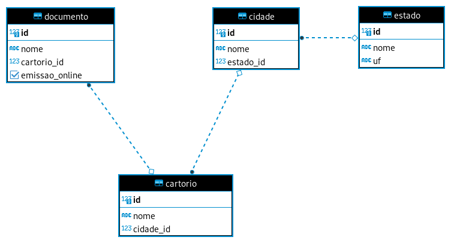

# Trabalhe conosco Docket Dados BI

## Sumário

- [Trabalhe conosco Docket Dados BI](#trabalhe-conosco-docket-dados-bi)
  - [Proposta](#proposta)
  - [Briefing](#briefing)
  - [O que fazemos](#o-que-fazemos)
  - [Requisitos](#requisitos)
    - [História do Usuário](#historia-do-usuario)
    - [Requisitos Obrigatórios](#requisitos-obrigatorios)
    - [Requisitos Opcionais (diferenciais)](#requisitos-opcionais)
    - [Sugestão de Ferramenta para realização do Teste](#sugestao-ferramenta)
  - [Como participar](#como-participar)
    - [Planejamento](#planejamento)
    - [Dados](#dados)
    - [Perguntas](#perguntas)
        - [Importante](#importante)
    - [Entrega](#entrega)

## Proposta
Neste teste para a área de dados, a partir do briefing e requisito apresentados, a Docket propõe a você responder as questões sobre 4 tabelas que terão conexão entre si, de forma a satisfazer as perguntas realizadas.

## Briefing
Uma empresa com a proposta de desburocratizar os serviços cartorários para pessoas físicas e pequenas empresas, e de reduzir o tempo de entrega dos documentos aos seus clientes. 

## O que fazemos
- Buscamos documentos em todo Brasil;
- Entregamos os documentos aos clientes em prazos estabelecidos e calculados.

# Requisitos

## História do Usuário
Como analista da área de dados, preciso levar os dados de forma concisa para o meu cliente interno tomar decisões a partir destes, de forma que toda parte de precauções nos dados sejam previamente tomadas.

## Requisitos Obrigatórios
- Conhecimento em PostgreSQL;
- Conhecimento em modelagem de dados;
- Conhecimento em fundamentos de análises de dados;
- Conhecimento em visualização de dados.

## Requisitos Opcionais (diferenciais)

- Outras ferramentas de visualização ex: Power BI, Tableau, Qlikview, Metabase;
- Linguagens de programação: Python;
- Conhecimento de modelos preditivos.

## Sugestão de Ferramenta para realização do Teste
- [SQL Fiddle](http://sqlfiddle.com/).

# Como participar

## Planejamento
- Nos conte como irá se planejar para conseguir entender o significado das tabelas, como são seus funcionamentos e quais cuidados devem ser tomados, se utilizou alguma ferramenta para se organizar, se desenhou algum diagrama e etc.

## Dados
- DDL das tabelas `Cidade`, `Estado`, `Cartorio` e `Documento` está disponível no arquivo [./sql/ddl.sql](./sql/ddl.sql).
- Segue o diagrama da estrutura para análise:

## Perguntas
  1. Qual é a cidade que mais emite documentos de forma online?
  1. Qual estado/cidade emite mais documentos de forma geral?
  1. Exiba quais cartórios emitem "`Certidão`".
  1. Qual cartório emite mais tipos distintos de documentos?
  1. Quantos cartórios tem no estado de São Paulo?
  1. O documento "`Cartão do Simples Nacional`" é emitido de forma manual em quais cartórios?
  
### Importante
- Responder todas as questões usando **queries em SQL**, utilizando a [estrutura](./sql/ddl.sql) fornecida para encontrar as respostas. 

## Entrega
- Envie por email o seguinte conteúdo:
    - Documento com as respostas das 6 [perguntas](#perguntas) acima em SQL;
    - Descrição do [planejamento](#planejamento);
    - Currículo em anexo ou link do perfil no [linkedin.com](https://linkedin.com).

Se ficou com alguma dúvida estamos à disposição.

Boa sorte!
